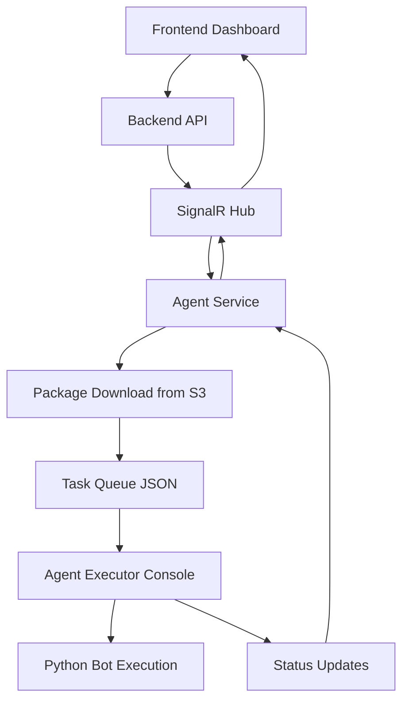
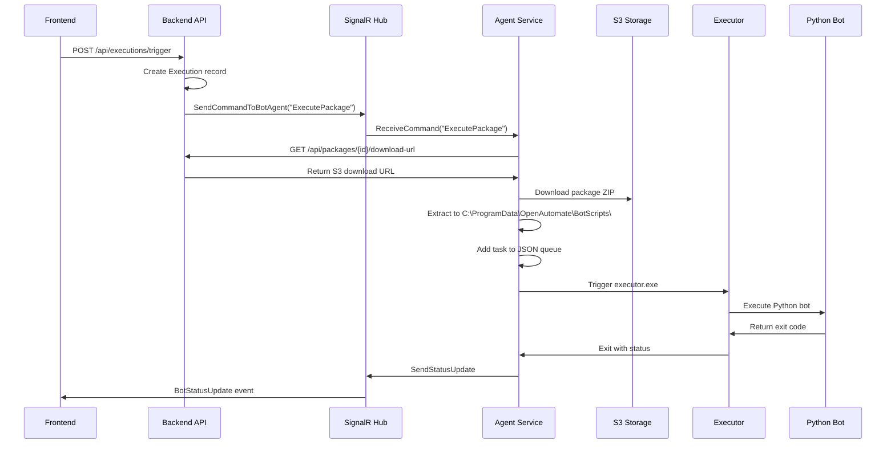

# C# Development Guide: Simple Bot Agent Executor with Orchestration

## Overview

This document outlines the implementation of a Simple Bot Agent Executor for OpenAutomate, designed as a **console application** that integrates with the orchestration system. The flow includes backend triggering, package download from S3, and bot execution.

**Complete Orchestration Flow:** 
Frontend → Backend API → SignalR Hub → Agent Service → Package Download → Agent Executor → Bot Execution

## Architecture Overview



## Complete Execution Flow

### **1. Execution Trigger (Backend)**


## Core Components

### 1. Synchronization Strategy

The executor uses `SemaphoreSlim` instead of `Mutex` for preventing concurrent execution instances. This design choice provides several benefits:

- **Async-Compatible**: `SemaphoreSlim` works correctly with `async/await` patterns, unlike `Mutex` which has thread affinity requirements
- **No Thread Ownership Issues**: Eliminates the "Object synchronization method was called from an unsynchronized block of code" errors
- **Better Error Handling**: Provides specific exception types for different failure scenarios
- **Cleaner Code**: Simpler synchronization logic without complex mutex validation

```csharp
// SemaphoreSlim allows only one executor instance at a time
private readonly SemaphoreSlim _executorSemaphore = new SemaphoreSlim(1, 1);

// Async-compatible acquisition with timeout
var semaphoreAcquired = await _executorSemaphore.WaitAsync(100);
```

### 2. Enhanced Task Model

```csharp
namespace OpenAutomate.BotAgent.Executor
{
    public class BotTask
    {
        public string TaskId { get; set; } = Guid.NewGuid().ToString();
        public string ScriptPath { get; set; }
        public string PackageId { get; set; }
        public string PackageName { get; set; }
        public string Version { get; set; }
        public string Status { get; set; } = "Pending"; // Pending, Running, Completed, Failed
        public DateTime CreatedTime { get; set; } = DateTime.UtcNow;
        public DateTime? StartTime { get; set; }
        public DateTime? EndTime { get; set; }
        public int? Pid { get; set; }
        public string? ErrorMessage { get; set; }
        public string? ExecutionId { get; set; } // Backend execution ID
    }

    public class TaskQueue
    {
        public List<BotTask> Tasks { get; set; } = new();
        public DateTime LastUpdated { get; set; } = DateTime.UtcNow;
    }
}
```

### 3. Enhanced Task Executor (Console Application)

```csharp
namespace OpenAutomate.BotAgent.Executor
{
    public class Program
    {
        private static readonly ILogger _logger = CreateLogger();

        public static async Task<int> Main(string[] args)
        {
            try
            {
                _logger.LogInformation("Bot Agent Executor started");

                var executor = new SimpleTaskExecutor(_logger);
                var hasWork = await executor.ProcessNextTaskAsync();

                if (hasWork)
                {
                    _logger.LogInformation("Task processing completed");
                    return 0; // Success
                }
                else
                {
                    _logger.LogInformation("No tasks to process");
                    return 1; // No work
                }
            }
            catch (Exception ex)
            {
                _logger.LogError(ex, "Fatal error in executor");
                return -1; // Error
            }
        }

        private static ILogger CreateLogger()
        {
            var loggerFactory = LoggerFactory.Create(builder =>
                builder.AddConsole()
                       .AddFile(@"C:\ProgramData\OpenAutomate\Logs\executor-{Date}.log")
                       .SetMinimumLevel(LogLevel.Information));
            return loggerFactory.CreateLogger<Program>();
        }
    }

    public class SimpleTaskExecutor : IDisposable
    {
        private static readonly string TaskQueuePath = @"C:\ProgramData\OpenAutomate\TaskQueue.json";
        private static readonly string BotScriptsPath = @"C:\ProgramData\OpenAutomate\BotScripts";
        private static readonly string VirtualEnvName = "botvenv";

        private readonly ILogger _logger;
        private readonly object _lockObject = new object();
        private readonly SemaphoreSlim _executorSemaphore = new SemaphoreSlim(1, 1); // Only allow one executor at a time
        private bool _disposed = false;

        public SimpleTaskExecutor(ILogger logger)
        {
            _logger = logger;
            EnsureDirectoryExists();
        }

        public async Task<bool> ProcessNextTaskAsync()
        {
            _logger.LogInformation("Starting task processing cycle");

            // Try to acquire the semaphore with a short timeout to prevent multiple executors running
            var semaphoreAcquired = await _executorSemaphore.WaitAsync(100);

            if (!semaphoreAcquired)
            {
                _logger.LogInformation("Another executor instance is already running, exiting");
                return false;
            }

            try
            {
                _logger.LogDebug("Acquired executor semaphore");

                var task = GetNextPendingTask();
                if (task == null)
                {
                    _logger.LogDebug("No pending tasks found");
                    return false;
                }

                _logger.LogInformation("Found pending task {TaskId}, executing", task.TaskId);
                return await ExecuteTaskAsync(task);
            }
            catch (Exception ex)
            {
                _logger.LogError(ex, "Error during task processing");
                return false;
            }
            finally
            {
                // Always release the semaphore if we acquired it
                try
                {
                    _executorSemaphore.Release();
                    _logger.LogDebug("Released executor semaphore");
                }
                catch (ObjectDisposedException ex)
                {
                    _logger.LogDebug(ex, "Semaphore was already disposed, skipping release");
                }
                catch (SemaphoreFullException ex)
                {
                    _logger.LogDebug(ex, "Semaphore was already at maximum count, skipping release");
                }
                catch (Exception ex)
                {
                    _logger.LogWarning(ex, "Unexpected error releasing semaphore");
                }
            }
        }

        public void Dispose()
        {
            if (_disposed)
                return;

            _disposed = true;

            // Dispose the semaphore
            try
            {
                _executorSemaphore?.Dispose();
            }
            catch (Exception ex)
            {
                _logger.LogDebug(ex, "Error disposing semaphore (non-critical)");
            }
        }

        private async Task<bool> ExecuteTaskAsync(BotTask task)
        {
            _logger.LogInformation("Executing task {TaskId} for package {PackageName} v{Version}", 
                task.TaskId, task.PackageName, task.Version);

            // Validate script path exists
            if (!Directory.Exists(task.ScriptPath))
            {
                var errorMsg = $"Script path does not exist: {task.ScriptPath}";
                UpdateTaskStatus(task, "Failed", errorMessage: errorMsg);
                return false;
            }

            // Update task to running
            UpdateTaskStatus(task, "Running", Process.GetCurrentProcess().Id);

            try
            {
                // Ensure virtual environment
                await EnsureVirtualEnvironmentAsync(task.ScriptPath);

                // Execute Python bot using bot.py (from bot-example structure)
                var success = await ExecutePythonBotAsync(task.ScriptPath);

                // Update final status
                var finalStatus = success ? "Completed" : "Failed";
                UpdateTaskStatus(task, finalStatus);

                // Cleanup script folder after execution
                await CleanupScriptFolderAsync(task.ScriptPath);

                return success;
            }
            catch (Exception ex)
            {
                _logger.LogError(ex, "Error executing task {TaskId}", task.TaskId);
                UpdateTaskStatus(task, "Failed", errorMessage: ex.Message);
                
                // Cleanup on failure too
                await CleanupScriptFolderAsync(task.ScriptPath);
                return false;
            }
        }

        private async Task CleanupScriptFolderAsync(string scriptPath)
        {
            try
            {
                if (Directory.Exists(scriptPath))
                {
                    // Wait a bit for any file handles to be released
                    await Task.Delay(1000);
                    
                    Directory.Delete(scriptPath, true);
                    _logger.LogInformation("Cleaned up script folder: {ScriptPath}", scriptPath);
                }
            }
            catch (Exception ex)
            {
                _logger.LogWarning(ex, "Failed to cleanup script folder: {ScriptPath}", scriptPath);
            }
        }
    }
}
```

### 4. Enhanced Task Queue Manager

```csharp
namespace OpenAutomate.BotAgent.Executor
{
    public partial class SimpleTaskExecutor
    {
        private BotTask GetNextPendingTask()
        {
            lock (_lockObject)
            {
                var queue = LoadTaskQueue();
                return queue.Tasks
                    .Where(t => t.Status == "Pending")
                    .OrderBy(t => t.CreatedTime)
                    .FirstOrDefault();
            }
        }

        private void UpdateTaskStatus(BotTask task, string status, int? pid = null, string errorMessage = null)
        {
            lock (_lockObject)
            {
                task.Status = status;
                task.ErrorMessage = errorMessage;
                
                if (pid.HasValue)
                    task.Pid = pid.Value;
                
                if (status == "Running")
                    task.StartTime = DateTime.UtcNow;
                
                if (status is "Completed" or "Failed")
                    task.EndTime = DateTime.UtcNow;

                var queue = LoadTaskQueue();
                SaveTaskQueueSafely(queue);
                _logger.LogInformation("Task {TaskId} status updated to {Status}", task.TaskId, status);
            }
        }

        private TaskQueue LoadTaskQueue()
        {
            try
            {
                if (!File.Exists(TaskQueuePath))
                {
                    var emptyQueue = new TaskQueue();
                    SaveTaskQueueSafely(emptyQueue);
                    return emptyQueue;
                }

                var json = File.ReadAllText(TaskQueuePath);
                return JsonConvert.DeserializeObject<TaskQueue>(json) ?? new TaskQueue();
            }
            catch (Exception ex)
            {
                _logger.LogError(ex, "Error loading task queue, creating new one");
                return new TaskQueue();
            }
        }

        private void SaveTaskQueueSafely(TaskQueue queue)
        {
            try
            {
                queue.LastUpdated = DateTime.UtcNow;
                var tempPath = TaskQueuePath + ".tmp";
                
                var json = JsonConvert.SerializeObject(queue, Formatting.Indented);
                File.WriteAllText(tempPath, json);
                
                if (File.Exists(TaskQueuePath))
                    File.Delete(TaskQueuePath);
                    
                File.Move(tempPath, TaskQueuePath);
            }
            catch (Exception ex)
            {
                _logger.LogError(ex, "Error saving task queue");
                throw;
            }
        }

        public void AddTask(string packageId, string packageName, string version, string executionId = null)
        {
            var scriptPath = Path.Combine(BotScriptsPath, $"{packageName}_{version}_{Guid.NewGuid():N}");
            
            var task = new BotTask
            {
                ScriptPath = scriptPath,
                PackageId = packageId,
                PackageName = packageName,
                Version = version,
                ExecutionId = executionId
            };

            lock (_lockObject)
            {
                var queue = LoadTaskQueue();
                queue.Tasks.Add(task);
                SaveTaskQueueSafely(queue);
            }

            _logger.LogInformation("Task {TaskId} added to queue for package {PackageName} v{Version}", 
                task.TaskId, packageName, version);
        }
    }
}
```

### 5. Enhanced Python Environment Manager

```csharp
namespace OpenAutomate.BotAgent.Executor
{
    public partial class SimpleTaskExecutor
    {
        private async Task EnsureVirtualEnvironmentAsync(string scriptPath)
        {
            var venvPath = Path.Combine(scriptPath, VirtualEnvName);
            var pythonExePath = Path.Combine(venvPath, "Scripts", "python.exe");

            // Check if virtual environment exists
            if (!File.Exists(pythonExePath))
            {
                _logger.LogInformation("Creating virtual environment at {VenvPath}", venvPath);
                await CreateVirtualEnvironmentAsync(venvPath);
            }

            // Install requirements if they exist
            var requirementsPath = Path.Combine(scriptPath, "requirements.txt");
            if (File.Exists(requirementsPath))
            {
                _logger.LogInformation("Installing requirements from {RequirementsPath}", requirementsPath);
                await InstallRequirementsAsync(pythonExePath, requirementsPath);
            }
        }

        private async Task CreateVirtualEnvironmentAsync(string venvPath)
        {
            var result = await ExecuteCommandAsync("python", $"-m venv \"{venvPath}\"");
            if (!result.Success)
            {
                throw new InvalidOperationException($"Failed to create virtual environment: {result.Error}");
            }
        }

        private async Task InstallRequirementsAsync(string pythonExePath, string requirementsPath)
        {
            var args = $"-m pip install -r \"{requirementsPath}\" --trusted-host=pypi.python.org --trusted-host=pypi.org --trusted-host=files.pythonhosted.org";
            var result = await ExecuteCommandAsync(pythonExePath, args);
            
            if (!result.Success)
            {
                _logger.LogWarning("Failed to install requirements: {Error}", result.Error);
                // Don't throw - let the bot try to run anyway
            }
        }
    }
}
```

### 6. Enhanced Process Manager

```csharp
namespace OpenAutomate.BotAgent.Executor
{
    public class CommandResult
    {
        public bool Success { get; set; }
        public int ExitCode { get; set; }
        public string Output { get; set; }
        public string Error { get; set; }
    }

    public partial class SimpleTaskExecutor
    {
        private async Task<bool> ExecutePythonBotAsync(string scriptPath)
        {
            var venvPath = Path.Combine(scriptPath, VirtualEnvName);
            var pythonExePath = Path.Combine(venvPath, "Scripts", "python.exe");
            
            // Look for bot.py (from bot-example structure) or fallback to main.py
            var botScriptPath = Path.Combine(scriptPath, "bot.py");
            var mainScriptPath = Path.Combine(scriptPath, "main.py");

            string scriptToRun;
            if (File.Exists(botScriptPath))
            {
                scriptToRun = "bot.py";
                _logger.LogInformation("Found bot.py, using bot-example structure");
            }
            else if (File.Exists(mainScriptPath))
            {
                scriptToRun = "main.py";
                _logger.LogInformation("Found main.py, using template structure");
            }
            else
            {
                _logger.LogError("Neither bot.py nor main.py found at {ScriptPath}", scriptPath);
                return false;
            }

            _logger.LogInformation("Executing Python bot: {PythonExe} {Script}", pythonExePath, scriptToRun);

            var result = await ExecuteCommandAsync(
                pythonExePath, 
                scriptToRun, 
                scriptPath,
                timeoutMs: 600000 // 10 minutes timeout for bot execution
            );

            if (result.Success)
            {
                _logger.LogInformation("Python bot completed successfully");
                return true;
            }
            else
            {
                _logger.LogError("Python bot failed with exit code {ExitCode}: {Error}", result.ExitCode, result.Error);
                return false;
            }
        }

        private async Task<CommandResult> ExecuteCommandAsync(
            string executable, 
            string arguments, 
            string workingDirectory = null, 
            int timeoutMs = 60000)
        {
            var startInfo = new ProcessStartInfo
            {
                FileName = executable,
                Arguments = arguments,
                UseShellExecute = false,
                RedirectStandardOutput = true,
                RedirectStandardError = true,
                CreateNoWindow = true,
                WorkingDirectory = workingDirectory ?? Environment.CurrentDirectory
            };

            var outputBuilder = new StringBuilder();
            var errorBuilder = new StringBuilder();

            using var process = new Process { StartInfo = startInfo };
            
            process.OutputDataReceived += (sender, e) =>
            {
                if (!string.IsNullOrEmpty(e.Data))
                {
                    outputBuilder.AppendLine(e.Data);
                    _logger.LogInformation("[stdout] {Output}", e.Data);
                }
            };

            process.ErrorDataReceived += (sender, e) =>
            {
                if (!string.IsNullOrEmpty(e.Data))
                {
                    errorBuilder.AppendLine(e.Data);
                    _logger.LogWarning("[stderr] {Error}", e.Data);
                }
            };

            process.Start();
            process.BeginOutputReadLine();
            process.BeginErrorReadLine();

            var completed = await Task.Run(() => process.WaitForExit(timeoutMs));

            if (!completed)
            {
                _logger.LogWarning("Process timed out after {TimeoutMs}ms, killing process", timeoutMs);
                try
                {
                    process.Kill();
                }
                catch (Exception ex)
                {
                    _logger.LogError(ex, "Failed to kill timed out process");
                }
                
                return new CommandResult
                {
                    Success = false,
                    ExitCode = -1,
                    Error = $"Process timed out after {timeoutMs}ms"
                };
            }

            return new CommandResult
            {
                Success = process.ExitCode == 0,
                ExitCode = process.ExitCode,
                Output = outputBuilder.ToString(),
                Error = errorBuilder.ToString()
            };
        }

        private void EnsureDirectoryExists()
        {
            var directory = Path.GetDirectoryName(TaskQueuePath);
            if (!Directory.Exists(directory))
            {
                Directory.CreateDirectory(directory);
                _logger.LogInformation("Created directory {Directory}", directory);
            }
            
            if (!Directory.Exists(BotScriptsPath))
            {
                Directory.CreateDirectory(BotScriptsPath);
                _logger.LogInformation("Created bot scripts directory {Directory}", BotScriptsPath);
            }
        }
    }
}
```

## Backend Integration

### 1. Enhanced Execution Controller

```csharp
namespace OpenAutomate.API.Controllers
{
    [ApiController]
    [Route("{tenant}/api/executions")]
    [Authorize]
    public class ExecutionController : ControllerBase
    {
        private readonly IExecutionService _executionService;
        private readonly IBotAgentService _botAgentService;
        private readonly IAutomationPackageService _packageService;
        private readonly IHubContext<BotAgentHub> _hubContext;
        private readonly ITenantContext _tenantContext;
        private readonly ILogger<ExecutionController> _logger;

        public ExecutionController(
            IExecutionService executionService,
            IBotAgentService botAgentService,
            IAutomationPackageService packageService,
            IHubContext<BotAgentHub> hubContext,
            ITenantContext tenantContext,
            ILogger<ExecutionController> logger)
        {
            _executionService = executionService;
            _botAgentService = botAgentService;
            _packageService = packageService;
            _hubContext = hubContext;
            _tenantContext = tenantContext;
            _logger = logger;
        }

        [HttpPost("trigger")]
        [RequirePermission(Resources.ExecutionResource, Permissions.Create)]
        public async Task<IActionResult> TriggerExecution([FromBody] TriggerExecutionRequest request)
        {
            try
            {
                // Validate bot agent exists and is available
                var botAgent = await _botAgentService.GetBotAgentByIdAsync(request.BotAgentId);
                if (botAgent == null)
                    return NotFound("Bot agent not found");

                if (botAgent.Status != "Available")
                    return BadRequest("Bot agent is not available");

                // Validate package exists
                var package = await _packageService.GetPackageByIdAsync(request.PackageId);
                if (package == null)
                    return NotFound("Package not found");

                // Create execution record
                var execution = await _executionService.CreateExecutionAsync(new CreateExecutionDto
                {
                    BotAgentId = request.BotAgentId,
                    PackageId = request.PackageId,
                    ScheduleId = request.ScheduleId
                });

                // Send command to bot agent via SignalR
                var commandPayload = new
                {
                    ExecutionId = execution.Id,
                    PackageId = request.PackageId,
                    PackageName = package.Name,
                    Version = request.Version ?? package.Versions?.FirstOrDefault()?.Version ?? "latest"
                };

                await _hubContext.Clients.Group($"bot-{request.BotAgentId}")
                    .SendAsync("ReceiveCommand", "ExecutePackage", commandPayload);

                _logger.LogInformation("Execution {ExecutionId} triggered for bot agent {BotAgentId}", 
                    execution.Id, request.BotAgentId);

                return Ok(new { ExecutionId = execution.Id, Status = "Triggered" });
            }
            catch (Exception ex)
            {
                _logger.LogError(ex, "Error triggering execution");
                return StatusCode(500, "Error triggering execution");
            }
        }

        [HttpGet("{executionId}/status")]
        [RequirePermission(Resources.ExecutionResource, Permissions.View)]
        public async Task<IActionResult> GetExecutionStatus(Guid executionId)
        {
            try
            {
                var execution = await _executionService.GetExecutionByIdAsync(executionId);
                if (execution == null)
                    return NotFound("Execution not found");

                return Ok(execution);
            }
            catch (Exception ex)
            {
                _logger.LogError(ex, "Error getting execution status");
                return StatusCode(500, "Error getting execution status");
            }
        }
    }

    public class TriggerExecutionRequest
    {
        public Guid BotAgentId { get; set; }
        public Guid PackageId { get; set; }
        public string? Version { get; set; }
        public Guid? ScheduleId { get; set; }
    }
}
```

### 2. Enhanced Package Download Endpoint

```csharp
namespace OpenAutomate.API.Controllers
{
    public partial class AutomationPackageController
    {
        /// <summary>
        /// Gets a secure download URL for a package version (for bot agents)
        /// </summary>
        [HttpGet("{id}/versions/{version}/agent-download")]
        [AllowAnonymous] // Bot agents use machine key auth
        public async Task<IActionResult> GetAgentDownloadUrl(Guid id, string version, [FromQuery] string machineKey)
        {
            try
            {
                // Validate machine key
                var botAgents = await _botAgentService.GetAllBotAgentsAsync();
                var botAgent = botAgents.FirstOrDefault(ba => ba.MachineKey == machineKey);
                if (botAgent == null)
                    return Unauthorized("Invalid machine key");

                // Get download URL
                var downloadUrl = await _packageService.GetPackageDownloadUrlAsync(id, version);
                
                return Ok(new { 
                    downloadUrl,
                    packageId = id,
                    version,
                    expiresAt = DateTime.UtcNow.AddHours(1) // URL expires in 1 hour
                });
            }
            catch (ArgumentException ex)
            {
                return NotFound(ex.Message);
            }
            catch (Exception ex)
            {
                _logger.LogError(ex, "Error getting agent download URL");
                return StatusCode(500, "Error getting download URL");
            }
        }
    }
}
```

## Agent Service Integration

### 1. Enhanced Execution Manager

```csharp
namespace OpenAutomate.BotAgent.Service.Core
{
    public interface IExecutionManager
    {
        Task StartExecutionAsync(object executionData);
        Task<bool> HasActiveExecutionsAsync();
        Task CancelExecutionAsync(string executionId);
    }

public class ExecutionManager : IExecutionManager
{
    private readonly ILogger<ExecutionManager> _logger;
        private readonly IConfigurationService _configService;
        private readonly IPackageDownloadService _packageDownloadService;
        private readonly string _executorPath;
        private readonly string _botScriptsPath = @"C:\ProgramData\OpenAutomate\BotScripts";

        public ExecutionManager(
            ILogger<ExecutionManager> logger,
            IConfigurationService configService,
            IPackageDownloadService packageDownloadService)
        {
            _logger = logger;
            _configService = configService;
            _packageDownloadService = packageDownloadService;
            _executorPath = Path.Combine(AppDomain.CurrentDomain.BaseDirectory, "OpenAutomate.BotAgent.Executor.exe");
        }

        public async Task StartExecutionAsync(object executionData)
    {
        try
        {
                var execution = JsonSerializer.Deserialize<ExecutionCommand>(
                    JsonSerializer.Serialize(executionData));

                _logger.LogInformation("Starting execution {ExecutionId} for package {PackageName} v{Version}",
                    execution.ExecutionId, execution.PackageName, execution.Version);

                // Download package from backend
                var downloadPath = await _packageDownloadService.DownloadPackageAsync(
                    execution.PackageId, execution.Version);

                if (string.IsNullOrEmpty(downloadPath))
                {
                    _logger.LogError("Failed to download package {PackageId}", execution.PackageId);
                    return;
                }

                // Add task to executor queue
                var executor = new SimpleTaskExecutor(_logger);
                executor.AddTask(execution.PackageId, execution.PackageName, execution.Version, execution.ExecutionId);

                // Trigger executor
                await TriggerExecutorAsync();

                _logger.LogInformation("Execution {ExecutionId} queued successfully", execution.ExecutionId);
            }
            catch (Exception ex)
            {
                _logger.LogError(ex, "Error starting execution");
            }
        }

        private async Task TriggerExecutorAsync()
        {
            try
            {
            var startInfo = new ProcessStartInfo
            {
                FileName = _executorPath,
                UseShellExecute = false,
                RedirectStandardOutput = true,
                RedirectStandardError = true,
                CreateNoWindow = true
            };

            using var process = new Process { StartInfo = startInfo };
            process.Start();
            await process.WaitForExitAsync();

                _logger.LogInformation("Executor finished with exit code: {ExitCode}", process.ExitCode);
            }
            catch (Exception ex)
            {
                _logger.LogError(ex, "Failed to trigger executor");
            }
        }

        public async Task<bool> HasActiveExecutionsAsync()
        {
            // Check if there are running tasks in the queue
            var taskQueuePath = @"C:\ProgramData\OpenAutomate\TaskQueue.json";
            if (!File.Exists(taskQueuePath))
                    return false;

            try
            {
                var json = await File.ReadAllTextAsync(taskQueuePath);
                var queue = JsonSerializer.Deserialize<TaskQueue>(json);
                return queue?.Tasks?.Any(t => t.Status == "Running") ?? false;
            }
            catch
            {
                    return false;
            }
        }

        public async Task CancelExecutionAsync(string executionId)
        {
            // Implementation for canceling execution
            _logger.LogInformation("Canceling execution {ExecutionId}", executionId);
            // TODO: Implement cancellation logic
        }
    }

    public class ExecutionCommand
    {
        public string ExecutionId { get; set; }
        public string PackageId { get; set; }
        public string PackageName { get; set; }
        public string Version { get; set; }
    }
}
```

### 2. Package Download Service

```csharp
namespace OpenAutomate.BotAgent.Service.Services
{
    public interface IPackageDownloadService
    {
        Task<string> DownloadPackageAsync(string packageId, string version);
    }

    public class PackageDownloadService : IPackageDownloadService
    {
        private readonly ILogger<PackageDownloadService> _logger;
        private readonly IConfigurationService _configService;
        private readonly HttpClient _httpClient;
        private readonly string _botScriptsPath = @"C:\ProgramData\OpenAutomate\BotScripts";

        public PackageDownloadService(
            ILogger<PackageDownloadService> logger,
            IConfigurationService configService,
            HttpClient httpClient)
        {
            _logger = logger;
            _configService = configService;
            _httpClient = httpClient;
        }

        public async Task<string> DownloadPackageAsync(string packageId, string version)
        {
            try
            {
                var config = _configService.GetConfiguration();
                var downloadUrl = await GetDownloadUrlAsync(packageId, version, config.MachineKey);
                
                if (string.IsNullOrEmpty(downloadUrl))
                {
                    _logger.LogError("Failed to get download URL for package {PackageId} v{Version}", packageId, version);
                    return null;
                }

                // Create unique folder for this package instance
                var extractPath = Path.Combine(_botScriptsPath, $"{packageId}_{version}_{Guid.NewGuid():N}");
                Directory.CreateDirectory(extractPath);

                // Download package
                _logger.LogInformation("Downloading package from {DownloadUrl}", downloadUrl);
                var response = await _httpClient.GetAsync(downloadUrl);
                response.EnsureSuccessStatusCode();

                // Save to temp file
                var tempZipPath = Path.Combine(Path.GetTempPath(), $"{packageId}_{version}.zip");
                await using (var fileStream = File.Create(tempZipPath))
                {
                    await response.Content.CopyToAsync(fileStream);
                }

                // Extract package
                System.IO.Compression.ZipFile.ExtractToDirectory(tempZipPath, extractPath);
                
                // Cleanup temp file
                File.Delete(tempZipPath);

                _logger.LogInformation("Package extracted to {ExtractPath}", extractPath);
                return extractPath;
            }
            catch (Exception ex)
            {
                _logger.LogError(ex, "Error downloading package {PackageId} v{Version}", packageId, version);
                return null;
            }
        }

        private async Task<string> GetDownloadUrlAsync(string packageId, string version, string machineKey)
        {
            try
            {
                var config = _configService.GetConfiguration();
                var url = $"{config.ServerUrl}/api/packages/{packageId}/versions/{version}/agent-download?machineKey={machineKey}";
                
                var response = await _httpClient.GetAsync(url);
                response.EnsureSuccessStatusCode();
                
                var content = await response.Content.ReadAsStringAsync();
                var result = JsonSerializer.Deserialize<DownloadUrlResponse>(content);
                
                return result?.DownloadUrl;
            }
            catch (Exception ex)
            {
                _logger.LogError(ex, "Error getting download URL");
                return null;
            }
        }
    }

    public class DownloadUrlResponse
    {
        public string DownloadUrl { get; set; }
        public string PackageId { get; set; }
        public string Version { get; set; }
        public DateTime ExpiresAt { get; set; }
    }
}
```

## Enhanced SignalR Command Handling

### 1. Updated BotAgentSignalRClient

```csharp
namespace OpenAutomate.BotAgent.Service.Services
{
    public partial class BotAgentSignalRClient
    {
        private async Task HandleCommandAsync(string command, object payload)
        {
            try
            {
                switch (command)
                {
                    case "ExecutePackage":
                        _logger.LogInformation("Received ExecutePackage command");
                        await _executionManager.StartExecutionAsync(payload);
                        await SendStatusUpdateAsync("Busy", "Preparing execution");
                        break;
                        
                    case "CancelExecution":
                        var executionId = payload.ToString();
                        _logger.LogInformation("Received CancelExecution command for {ExecutionId}", executionId);
                        await _executionManager.CancelExecutionAsync(executionId);
                        break;
                        
                    case "Heartbeat":
                        await SendStatusUpdateAsync("Available");
                        break;
                        
                    default:
                        _logger.LogWarning("Unknown command received: {Command}", command);
                        break;
                }
            }
            catch (Exception ex)
            {
                _logger.LogError(ex, "Error handling command: {Command}", command);
                await SendStatusUpdateAsync("Error", $"Command failed: {ex.Message}");
            }
        }
    }
}
```

## Example JSON Task Queue

```json
{
  "Tasks": [
    {
      "TaskId": "12345678-1234-1234-1234-123456789012",
      "ScriptPath": "C:\\ProgramData\\OpenAutomate\\BotScripts\\web-scraper_1.0.0_abc123",
      "PackageId": "87654321-4321-4321-4321-210987654321",
      "PackageName": "web-scraper",
      "Version": "1.0.0",
      "Status": "Pending",
      "CreatedTime": "2024-12-29T10:00:00Z",
      "StartTime": null,
      "EndTime": null,
      "Pid": null,
      "ErrorMessage": null,
      "ExecutionId": "execution-123"
    },
    {
      "TaskId": "87654321-4321-4321-4321-210987654321",
      "ScriptPath": "C:\\ProgramData\\OpenAutomate\\BotScripts\\email-bot_2.1.0_def456",
      "PackageId": "12345678-1234-1234-1234-123456789012",
      "PackageName": "email-bot",
      "Version": "2.1.0",
      "Status": "Running",
      "CreatedTime": "2024-12-29T09:30:00Z",
      "StartTime": "2024-12-29T10:15:00Z",
      "EndTime": null,
      "Pid": 1234,
      "ErrorMessage": null,
      "ExecutionId": "execution-456"
    }
  ],
  "LastUpdated": "2024-12-29T10:15:30Z"
}
```

## Usage Examples

### Command Line Usage

```bash
# Run the executor once to process pending tasks
OpenAutomate.BotAgent.Executor.exe

# With arguments (future enhancement)
OpenAutomate.BotAgent.Executor.exe --check-tasks
OpenAutomate.BotAgent.Executor.exe --task-id "12345678-1234-1234-1234-123456789012"
```

### Exit Codes

- **0**: Task processed successfully
- **1**: No tasks to process
- **-1**: Error occurred

## Testing Strategy

### Integration Test Flow

```csharp
[TestClass]
public class ExecutionIntegrationTests
{
    [TestMethod]
    public async Task EndToEnd_PackageExecution_CompletesSuccessfully()
    {
        // 1. Upload package to backend
        // 2. Trigger execution via API
        // 3. Verify SignalR command sent
        // 4. Verify package download
        // 5. Verify task queue creation
        // 6. Verify executor execution
        // 7. Verify status updates
    }
}
```

## Deployment Considerations

### File Structure

```
C:\ProgramData\OpenAutomate\
├── TaskQueue.json
├── BotScripts\
│   ├── package1_v1.0.0_abc123\
│   │   ├── bot.py
│   │   ├── requirements.txt
│   │   ├── config\
│   │   └── botvenv\
│   └── package2_v2.1.0_def456\
├── Logs\
│   ├── executor-2024-12-29.log
│   └── agent-service.log
└── Config\
    └── agent-config.json
```

### Security Considerations

- Machine key validation for package downloads
- Secure S3 URLs with expiration
- Process isolation for bot execution
- Cleanup of temporary files
- Logging of all execution activities

## Benefits of This Orchestrated Approach

✅ **Complete Orchestration** - Frontend to bot execution flow
✅ **Secure Package Distribution** - S3 with signed URLs
✅ **Isolated Execution** - Each bot runs in its own folder
✅ **Real-time Status Updates** - SignalR integration throughout
✅ **Robust Error Handling** - Comprehensive logging and cleanup
✅ **Scalable Architecture** - Can handle multiple concurrent executions

## Conclusion

This enhanced implementation provides a complete orchestration system where the frontend can trigger bot executions, packages are securely downloaded from S3, and bots are executed in isolated environments with real-time status updates throughout the entire process. 